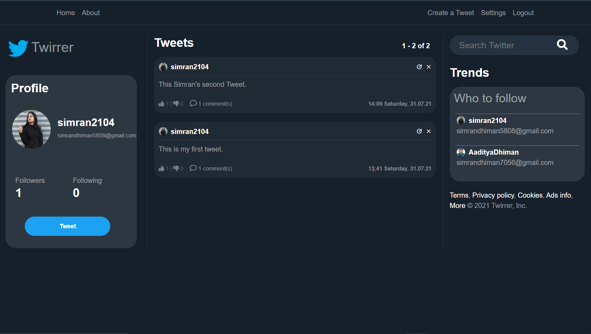

<h2 align="center">🕊 Twirrer - Twitter Clone using Django 🕊</h2>
Fully functional Django App that looks exactly like real Twitter.

----

## Technologies Used 👨🏽‍💻:
1. Python
2. Django
3. Sqlite3 Database
4. HTML, CSS, JavaScript
5. Bootstrap
6. SAWO API for login

---

## Features 📋
⚡️ SignUp and SignIn option.\
⚡️ Like or Unlike tweets.\
⚡️ Comments on tweets.\
⚡️ Create new tweets.\
⚡️ Modify previous tweets.\
⚡️ Delete tweets with one click.\
⚡️ Can view others as well as owns twirrer profiles.\
⚡️ Follow or Unfollow other users.\
⚡️ Login using SAWO APIs

----

## Snapshots:

<p align="center"></p>


----

## Installation 📦

>pip install -r requirements.txt

#### Clone

- Clone this repo to your local machine.

#### Run server locally

```shell
$ python manage.py runserver
```
> Go to localhost:8000

----

## Contributing 💡


#### Step 1

- **Option 1**
    - 🍴 Fork this repo!

- **Option 2**
    - 👯 Clone this repo to your local machine.


#### Step 2

- **Build your code** 🔨🔨🔨

#### Step 3

- 🔃 Create a new pull request.

----

## License 📄
This project is licensed under the MIT License - see the [LICENSE.md](./LICENSE) file for details.

----

## Authors:
<a href="https://simrandhiman.me/">Simran Dhiman</a>

#### If you like this project hit ⭐

<p align="center">Thanks for reading 🙏🏽</p>
